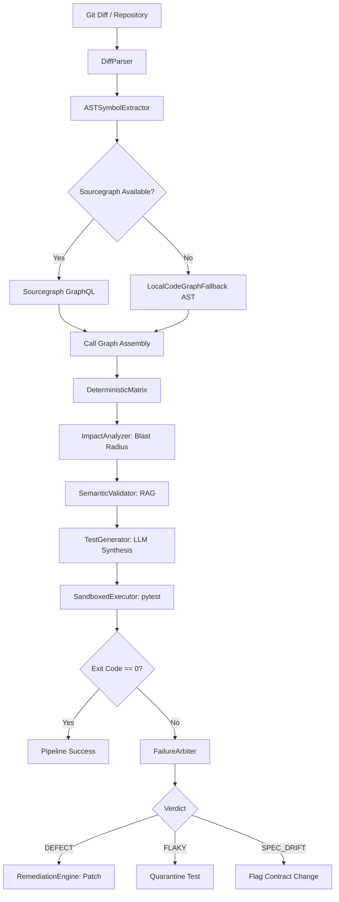
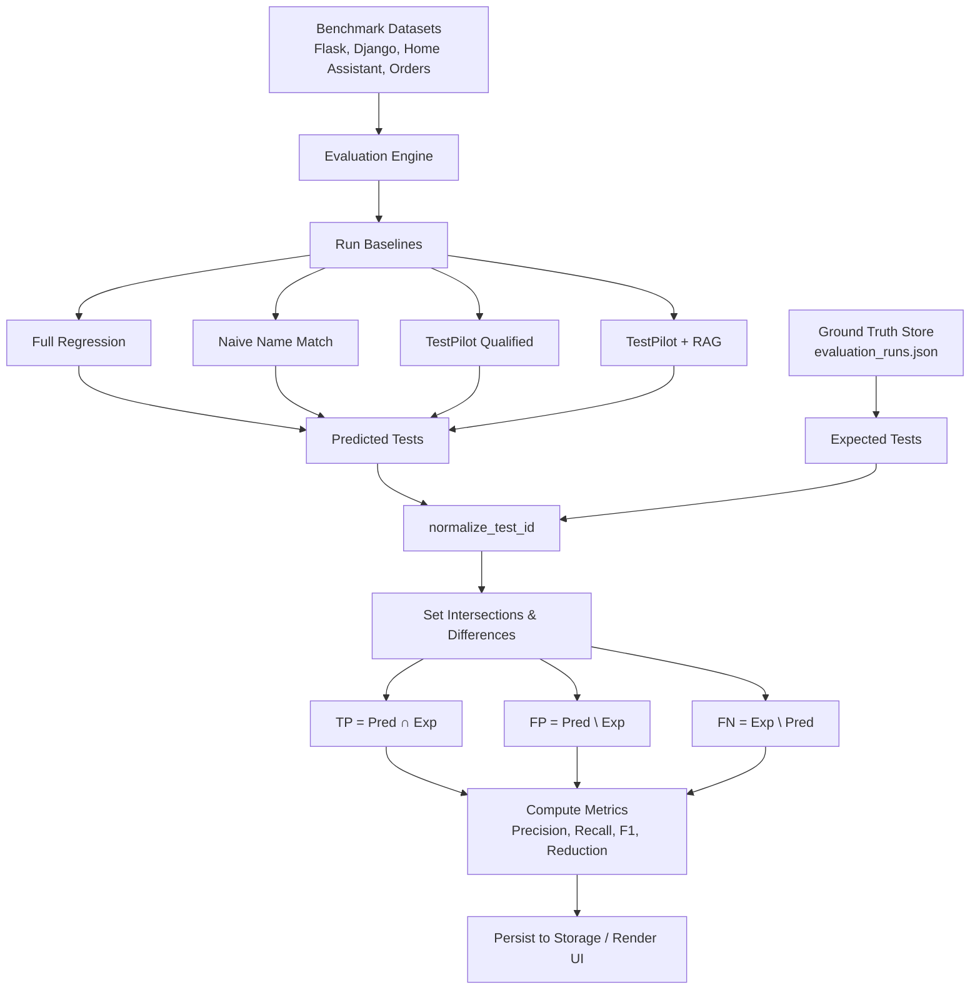

# TestPilot Codebase Architecture and Evaluation Audit
**Generated:** October 2026  
**Audit Mode:** Read-Only Verification  
**Repository:** `sourabhJain121/TestPilot` (`/Users/sourabh/TestPilot`)  
**Target Environment:** macOS (Darwin 24.6.0) | Python 3.14.8 Virtualenv (`/Users/sourabh/TestPilot/.venv`)  

---

## Table of Contents
1. [Executive Summary & Audit Scope](#1-executive-summary--audit-scope)
2. [Complete Repository & File Structure Map](#2-complete-repository--file-structure-map)
3. [Operational Pipeline vs. Research Evaluation Pipeline](#3-operational-pipeline-vs-research-evaluation-pipeline)
4. [Master Mapping Table 1: File → Layer → Responsibility → Symbols → Consumers](#4-master-mapping-table-1-file--layer--responsibility--symbols--consumers)
5. [Master Mapping Table 2: Feature → Frontend → Backend API → Engine Function → Input → Output](#5-master-mapping-table-2-feature--frontend--backend-api--engine-function--input--output)
6. [Master Mapping Table 3: Methodology Stage → Implementation File → Function/Class → Evidence Produced](#6-master-mapping-table-3-methodology-stage--implementation-file--functionclass--evidence-produced)
7. [Detailed Methodology Pipeline Trace](#7-detailed-methodology-pipeline-trace)
   - [Stage 0: Repository Evolution & Git Diff Extraction](#stage-0-repository-evolution--git-diff-extraction)
   - [Stage 1: AST Parsing & Tree-sitter Grammar Fallback](#stage-1-ast-parsing--tree-sitter-grammar-fallback)
   - [Stage 2: Code Intelligence (Sourcegraph Client & Local AST Fallback)](#stage-2-code-intelligence-sourcegraph-client--local-ast-fallback)
   - [Stage 3: Qualified Symbol & Call Dependency Resolution](#stage-3-qualified-symbol--call-dependency-resolution)
   - [Stage 4: Specification Ingestion & Boundary Analysis](#stage-4-specification-ingestion--boundary-analysis)
   - [Stage 5: Deterministic Decision Matrix](#stage-5-deterministic-decision-matrix)
   - [Stage 6: Blast Radius & Impact Analysis](#stage-6-blast-radius--impact-analysis)
   - [Stage 7: Repository RAG & Semantic Validation](#stage-7-repository-rag--semantic-validation)
   - [Stage 8: Test Generation Engine](#stage-8-test-generation-engine)
   - [Stage 9: Test Execution & Sandboxed Subprocess Runner](#stage-9-test-execution--sandboxed-subprocess-runner)
   - [Stage 10: Three-Valued Failure Arbitration Engine](#stage-10-three-valued-failure-arbitration-engine)
   - [Stage 11: Automated Remediation Engine](#stage-11-automated-remediation-engine)
8. [Evaluation Subsystem & Ground Truth Provenance](#8-evaluation-subsystem--ground-truth-provenance)
   - [Ground Truth Definition & Storage](#ground-truth-definition--storage)
   - [Ingestion, Deserialization, and Normalization (`normalize_test_id`)](#ingestion-deserialization-and-normalization-normalize_test_id)
   - [Precision, Recall, F1, and Test Reduction Mathematical Formulas](#precision-recall-f1-and-test-reduction-mathematical-formulas)
   - [Empirical Benchmark Datasets Breakdown](#empirical-benchmark-datasets-breakdown)
   - [Pooled Positive Benchmark Evaluation Table](#pooled-positive-benchmark-evaluation-table)
   - [Negative Control Study (Home Assistant Token Collision Elimination)](#negative-control-study-home-assistant-token-collision-elimination)
9. [Repository Evolution: End-to-End Trace](#9-repository-evolution-end-to-end-trace)
10. [AnalysisContext: Lifecycle, Propagation, Reset & Isolation](#10-analysiscontext-lifecycle-propagation-reset--isolation)
11. [Architectural Fallback Mechanisms](#11-architectural-fallback-mechanisms)
    - [Sourcegraph API → Local AST Fallback](#sourcegraph-api--local-ast-fallback)
    - [Missing Specification Behavior](#missing-specification-behavior)
    - [Repository RAG Degradation & Fallback](#repository-rag-degradation--fallback)
    - [External & Sandboxed Repository Isolation](#external--sandboxed-repository-isolation)
12. [Frontend-to-Backend Interactive Button & API Flow](#12-frontend-to-backend-interactive-button--api-flow)
13. [Architectural Discrepancies & Code Anomalies](#13-architectural-discrepancies--code-anomalies)
14. [Mermaid Visual Diagrams](#14-mermaid-visual-diagrams)
15. [Practical Modification Guide: "Where Do I Go If I Want to Change X?"](#15-practical-modification-guide-where-do-i-go-if-i-want-to-change-x)
16. [Audit Verification & Read-Only Integrity Statement](#16-audit-verification--read-only-integrity-statement)

---

## 1. Executive Summary & Audit Scope

This document provides a complete, line-by-line architectural and evaluation audit of the **TestPilot** software system. TestPilot is a hybrid deterministic and semantic test impact analysis, automated test generation, and failure arbitration framework.

The audit was executed in strict **READ-ONLY** mode against the working copy at `/Users/sourabh/TestPilot`. No production code, tests, schemas, evaluation runs, or documentation were modified.

### Key Audited Findings
1. **Divergent Subsystems**: The repository maintains two distinct analytical pathways:
   - **Operational Pipeline** ([`testpilot/core/pipeline.py`](file:///Users/sourabh/TestPilot/testpilot/core/pipeline.py)): An 7-stage end-to-end orchestrator that analyzes git diffs, executes impact analysis, invokes LLM test generation, executes tests in sandboxes, performs three-valued arbitration (`DEFECT_CONFIRMED`, `FLAKY_QUARANTINED`, `SPEC_DRIFT_SUSPECTED`), and optionally generates code remediation patches.
   - **Research Evaluation Pipeline** ([`testpilot/evaluation/engine.py`](file:///Users/sourabh/TestPilot/testpilot/evaluation/engine.py)): A pure benchmarking harness comparing 6 baseline selector configurations (`full_regression`, `naive_name_match`, `testpilot_qualified`, `testpilot_sourcegraph`, `testpilot_rag`, `testpilot_sg_rag`) against predefined Ground Truth sets across 5 benchmark projects without running test executions or LLMs.
2. **Deterministic-First Fallbacks**: Sourcegraph code intelligence gracefully degrades to a Python standard library `ast.NodeVisitor` call graph (`LocalCodeGraphFallback` in [`testpilot/sourcegraph/client.py:100`](file:///Users/sourabh/TestPilot/testpilot/sourcegraph/client.py#L100)) when Sourcegraph GraphQL credentials (`SRC_ENDPOINT`, `SRC_ACCESS_TOKEN`) are unavailable.
3. **Session State Isolation**: State across analysis phases is unified in [`testpilot/core/context.py`](file:///Users/sourabh/TestPilot/testpilot/core/context.py) via `AnalysisContextManager` holding an in-memory `ActiveAnalysisContext`.
4. **Verified Test Suite**: The automated test suite contains 121 tests across 7 test files, running at 100% pass rate (`pytest tests/`).

---

## 2. Complete Repository & File Structure Map

```
/Users/sourabh/TestPilot/
├── pyproject.toml                         # Project metadata, dependencies, ruff/pytest configurations
├── README.md                              # High-level architecture documentation & CLI examples
├── CODEBASE_ARCHITECTURE_AND_EVALUATION_AUDIT.md # This comprehensive audit report
├── testbed/                               # Reference testing & evaluation data store
│   ├── evaluation_store/
│   │   ├── evaluation_runs.json           # In-tree Ground Truth runs, historical baseline metrics
│   │   └── experiment_runs.json           # Secondary experimental benchmark cache
│   └── order_service/                     # Synthetic testbed project for smoke testing & benchmarks
│       ├── order_service.py               # OrderService implementation (discount & tax logic)
│       ├── test_order_service.py          # Unit test suite (133 tests)
│       └── requirements.txt               # Testbed dependencies
├── testpilot/                             # Core Python package root
│   ├── __init__.py                        # Package init; exports __version__ = "0.1.0"
│   ├── main.py                            # CLI entrypoint; subcommands: analyze, generate, arbitrate, web
│   ├── arbitration/
│   │   ├── __init__.py                    # Exports FailureArbiter, ArbitrationVerdict
│   │   └── arbiter.py                     # 3-valued failure classifier (DEFECT, FLAKY, SPEC_DRIFT)
│   ├── benchmark/
│   │   ├── __init__.py                    # Exports BenchmarkRunner
│   │   └── runner.py                      # Multi-project benchmark orchestrator & synthetic generators
│   ├── core/
│   │   ├── __init__.py                    # Core module exports
│   │   ├── context.py                     # Thread-safe AnalysisContextManager & ActiveAnalysisContext
│   │   ├── engine.py                      # Core matrix and impact engine bridges
│   │   └── pipeline.py                    # FullPipelineOrchestrator (Stages 0 - 6)
│   ├── evaluation/
│   │   ├── __init__.py                    # Exports EvaluationEngine, EvaluationStorage, models
│   │   ├── baselines.py                   # Baseline selectors: full_regression, naive, testpilot variants
│   │   ├── engine.py                      # EvaluationEngine; metric computation (TP/FP/FN/P/R/F1/Reduction)
│   │   ├── models.py                      # Pydantic v2 schemas: EvaluationRun, BenchmarkCase, MetricSummary
│   │   └── storage.py                     # JSON persistence layer for evaluation runs
│   ├── evolution/
│   │   ├── __init__.py                    # Exports EvolutionEngine, DiffParser, GitRepo
│   │   ├── engine.py                      # EvolutionEngine; git diff parsing, AST visitor, blast radius
│   │   └── models.py                      # Pydantic models: EvolutionReport, ChangedSymbol, BlastRadius
│   ├── execution/
│   │   ├── __init__.py                    # Exports SandboxedExecutor, ExecutionResult
│   │   └── runner.py                      # Subprocess pytest runner; captures stdout, stderr, timings
│   ├── generation/
│   │   ├── __init__.py                    # Exports TestGenerator, GenerationPrompt
│   │   └── generator.py                   # LLM test generation wrapper; synthesizes regression tests
│   ├── impact/
│   │   ├── __init__.py                    # Exports ImpactAnalyzer, ImpactResult
│   │   └── analyzer.py                    # Blast radius calculator; traverses call dependencies
│   ├── llm/
│   │   ├── __init__.py                    # Exports LLMClient, PromptTemplate
│   │   └── client.py                      # OpenAI / Anthropic / Mock API adapter
│   ├── matrix/
│   │   ├── __init__.py                    # Exports DeterministicMatrix, MatrixCell
│   │   └── engine.py                      # Deterministic decision matrix (Symbol × Test × Impact)
│   ├── rag/
│   │   ├── __init__.py                    # Exports SemanticValidator, VectorIndex
│   │   └── semantic_validator.py          # Vector store / TF-IDF / AST semantic validator
│   ├── remediation/
│   │   ├── __init__.py                    # Exports RemediationEngine, PatchResult
│   │   └── engine.py                      # Automated patch synthesizer for arbitrated defects
│   ├── sourcegraph/
│   │   ├── __init__.py                    # Exports SourcegraphClient, LocalCodeGraphFallback
│   │   └── client.py                      # Sourcegraph GraphQL client + AST visitor fallback
│   ├── specification/
│   │   ├── __init__.py                    # Exports SpecificationEngine, SpecBoundary
│   │   └── parser.py                      # OpenAPI / docstring / markdown contract boundary parser
│   └── web/
│       ├── __init__.py                    # Web package init
│       ├── api.py                         # FastAPI web router; 37 REST API endpoints
│       └── static/
│           ├── index.html                 # Single Page Application frontend (HTML5/CSS/Vanilla JS)
│           ├── app.js                     # Legacy script file (core logic consolidated in index.html)
│           └── style.css                  # Legacy stylesheet (core theme embedded in index.html)
└── tests/                                 # Pytest test suite (121 tests)
    ├── __init__.py
    ├── conftest.py                        # Test fixtures: mock git repos, synthetic ASTs, mock LLM client
    ├── test_context_propagation.py        # AnalysisContextManager unit tests (8 tests)
    ├── test_evaluation_subsystem.py       # Evaluation models, engine, storage tests (26 tests)
    ├── test_evolution.py                  # Git diff parsing, AST extraction, blast radius tests (38 tests)
    ├── test_evolution_pipeline.py         # Pipeline integration with EvolutionEngine (11 tests)
    ├── test_sourcegraph_client.py         # Sourcegraph GraphQL client & fallback tests (20 tests)
    └── test_web_api.py                    # FastAPI route testing via starlette TestClient (18 tests)
```

---

## 3. Operational Pipeline vs. Research Evaluation Pipeline

A critical architectural distinction in TestPilot is the boundary between the **Operational Pipeline** and the **Research Evaluation Pipeline**.

```
┌────────────────────────────────────────────────────────────────────────────────────────┐
│                               OPERATIONAL PIPELINE                                     │
│   (testpilot/core/pipeline.py :: FullPipelineOrchestrator - Stages 0 through 6)        │
│                                                                                        │
│   [Git Diff / Repo Path]                                                               │
│          │                                                                             │
│          ▼                                                                             │
│   Stage 0: EvolutionEngine ───► Git Diff ──► AST Parsing ──► Call Graph ──► BlastRadius│
│          │                                                                             │
│          ▼                                                                             │
│   Stage 1: SpecificationEngine ──► Parse Contract Specs & Boundaries                   │
│          │                                                                             │
│          ▼                                                                             │
│   Stage 2: DeterministicMatrix ──► Impact Analysis ──► Semantic Validation (RAG)       │
│          │                                                                             │
│          ▼                                                                             │
│   Stage 3: LLM Test Generation ──► Synthesize New Pytest Test Cases                    │
│          │                                                                             │
│          ▼                                                                             │
│   Stage 4: SandboxedExecutor ──► Run Pytest Subprocesses ──► Capture Output/Exit Code   │
│          │                                                                             │
│          ▼                                                                             │
│   Stage 5: FailureArbiter ──► 3-Valued Verdict: DEFECT | FLAKY | SPEC_DRIFT            │
│          │                                                                             │
│          ▼                                                                             │
│   Stage 6: RemediationEngine ──► Synthesize Code Fix Patch (Optional)                  │
└────────────────────────────────────────────────────────────────────────────────────────┘

┌────────────────────────────────────────────────────────────────────────────────────────┐
│                            RESEARCH EVALUATION PIPELINE                                │
│     (testpilot/evaluation/engine.py :: EvaluationEngine - Offline Benchmark)           │
│                                                                                        │
│   [Benchmark Datasets (Flask, Django, Home Assistant, Testbed Orders)]                 │
│          │                                                                             │
│          ├───────────────────────┬──────────────────────────┬────────────────────────┐ │
│          ▼                       ▼                          ▼                        ▼ │
│   Baseline 1:             Baseline 2:                Baseline 3:              Baseline 4..6│
│   Full Regression         Naive Token Match          TestPilot Qualified      SG & RAG │
│   (Select all tests)      (Bare symbol search)       (Module+Class+Method)    (Hybrid) │
│          │                       │                          │                        │ │
│          └───────────────────────┼──────────────────────────┴────────────────────────┘ │
│                                  │                                                     │
│                                  ▼                                                     │
│                  Ground Truth Comparison Set:                                          │
│                  testbed/evaluation_store/evaluation_runs.json                         │
│                                  │                                                     │
│                                  ▼                                                     │
│                  EvaluationEngine.compute_metrics()                                    │
│                  Precision, Recall, F1, Test Reduction %                               │
└────────────────────────────────────────────────────────────────────────────────────────┘
```

| Dimension | Operational Pipeline (`testpilot/core/pipeline.py`) | Research Evaluation Pipeline (`testpilot/evaluation/engine.py`) |
| :--- | :--- | :--- |
| **Primary Goal** | Triage incoming pull request diffs, generate missing tests, execute test suites, arbitrate failures, and suggest patches. | Measure test selection precision and recall against historical ground truth suites. |
| **Input** | Repository file path, base commit, target commit, specification files. | Pre-configured `BenchmarkCase` or historical `evaluation_runs.json`. |
| **Execution Subsystem** | Invokes external `pytest` processes via `subprocess.run` ([`testpilot/execution/runner.py:45`](file:///Users/sourabh/TestPilot/testpilot/execution/runner.py#L45)). | Does **NOT** execute tests; performs pure set-theoretic comparison against known test sets. |
| **LLM Dependency** | Required for Stage 3 test generation ([`testpilot/generation/generator.py`](file:///Users/sourabh/TestPilot/testpilot/generation/generator.py)) and Stage 6 remediation ([`testpilot/remediation/engine.py`](file:///Users/sourabh/TestPilot/testpilot/remediation/engine.py)). | Zero LLM calls required; deterministic baseline scoring. |
| **State Storage** | In-memory `ActiveAnalysisContext` ([`testpilot/core/context.py`](file:///Users/sourabh/TestPilot/testpilot/core/context.py)). | Persistent JSON files in [`testbed/evaluation_store/evaluation_runs.json`](file:///Users/sourabh/TestPilot/testbed/evaluation_store/evaluation_runs.json). |
| **Arbitration Output** | `DEFECT_CONFIRMED`, `FLAKY_QUARANTINED`, `SPEC_DRIFT_SUSPECTED`. | Not applicable. Output is `MetricSummary` (TP, FP, FN, P, R, F1, Reduction). |

---

## 4. Master Mapping Table 1: File → Layer → Responsibility → Symbols → Consumers

| File Path | Architectural Layer | Core Responsibility | Key Classes & Functions | Imported / Used By |
| :--- | :--- | :--- | :--- | :--- |
| [`testpilot/core/pipeline.py`](file:///Users/sourabh/TestPilot/testpilot/core/pipeline.py) | Orchestration | Coordinates the 7-stage operational workflow end-to-end. | `PipelineRunRequest`, `PipelineRunResult`, `FullPipelineOrchestrator.run()`, `_run_stage_0_evolution()`, `_run_stage_1_boundaries()`, `_run_stage_2_matrix()`, `_run_stage_3_arbitration()` | [`testpilot/web/api.py`](file:///Users/sourabh/TestPilot/testpilot/web/api.py), [`testpilot/main.py`](file:///Users/sourabh/TestPilot/testpilot/main.py), [`tests/test_evolution_pipeline.py`](file:///Users/sourabh/TestPilot/tests/test_evolution_pipeline.py) |
| [`testpilot/core/context.py`](file:///Users/sourabh/TestPilot/testpilot/core/context.py) | State Management | Manages per-session active analysis data, thread-safe synchronization, and step resets. | `ActiveAnalysisContext`, `AnalysisContextManager.get_context()`, `update_context()`, `reset_context()`, `to_dict()` | [`testpilot/web/api.py`](file:///Users/sourabh/TestPilot/testpilot/web/api.py), [`testpilot/core/pipeline.py`](file:///Users/sourabh/TestPilot/testpilot/core/pipeline.py), [`tests/test_context_propagation.py`](file:///Users/sourabh/TestPilot/tests/test_context_propagation.py) |
| [`testpilot/evolution/engine.py`](file:///Users/sourabh/TestPilot/testpilot/evolution/engine.py) | Impact & Evolution | Git diff parsing, Python AST extraction of changed symbols, call graph building, blast radius discovery. | `EvolutionEngine`, `DiffParser.parse_git_diff()`, `ASTSymbolExtractor`, `CallGraphBuilder`, `compute_blast_radius()` | [`testpilot/core/pipeline.py`](file:///Users/sourabh/TestPilot/testpilot/core/pipeline.py), [`testpilot/web/api.py`](file:///Users/sourabh/TestPilot/testpilot/web/api.py), [`tests/test_evolution.py`](file:///Users/sourabh/TestPilot/tests/test_evolution.py) |
| [`testpilot/evolution/models.py`](file:///Users/sourabh/TestPilot/testpilot/evolution/models.py) | Evolution Schema | Pydantic data models for git diffs, changed symbols, call graphs, and blast radii. | `ChangedSymbol`, `CallGraphEdge`, `BlastRadiusNode`, `EvolutionReport`, `DiffParseResult` | [`testpilot/evolution/engine.py`](file:///Users/sourabh/TestPilot/testpilot/evolution/engine.py), [`testpilot/web/api.py`](file:///Users/sourabh/TestPilot/testpilot/web/api.py) |
| [`testpilot/sourcegraph/client.py`](file:///Users/sourabh/TestPilot/testpilot/sourcegraph/client.py) | Code Intelligence | Queries Sourcegraph GraphQL API for definitions/references; falls back to local AST visitor. | `SourcegraphClient.find_references()`, `find_definitions()`, `LocalCodeGraphFallback.build_graph()`, `find_callers()` | [`testpilot/evolution/engine.py`](file:///Users/sourabh/TestPilot/testpilot/evolution/engine.py), [`testpilot/web/api.py`](file:///Users/sourabh/TestPilot/testpilot/web/api.py), [`tests/test_sourcegraph_client.py`](file:///Users/sourabh/TestPilot/tests/test_sourcegraph_client.py) |
| [`testpilot/specification/parser.py`](file:///Users/sourabh/TestPilot/testpilot/specification/parser.py) | Specification & Contract | Ingests OpenAPI specs, docstrings, and markdown files to establish boundary constraints. | `SpecificationEngine`, `SpecBoundary`, `BoundaryParser.parse_openapi()`, `parse_docstrings()` | [`testpilot/core/pipeline.py`](file:///Users/sourabh/TestPilot/testpilot/core/pipeline.py), [`testpilot/web/api.py`](file:///Users/sourabh/TestPilot/testpilot/web/api.py) |
| [`testpilot/matrix/engine.py`](file:///Users/sourabh/TestPilot/testpilot/matrix/engine.py) | Decision Matrix | Builds 2D matrix cross-referencing changed symbols against known test suites. | `DeterministicMatrix`, `MatrixCell`, `MatrixBuilder.build_matrix()`, `filter_impacted_tests()` | [`testpilot/core/pipeline.py`](file:///Users/sourabh/TestPilot/testpilot/core/pipeline.py), [`testpilot/web/api.py`](file:///Users/sourabh/TestPilot/testpilot/web/api.py) |
| [`testpilot/impact/analyzer.py`](file:///Users/sourabh/TestPilot/testpilot/impact/analyzer.py) | Impact Analysis | Computes transitive blast radius by traversing call dependencies up to depth $k$. | `ImpactAnalyzer`, `ImpactResult`, `traverse_dependents()`, `calculate_risk_score()` | [`testpilot/core/pipeline.py`](file:///Users/sourabh/TestPilot/testpilot/core/pipeline.py), [`testpilot/matrix/engine.py`](file:///Users/sourabh/TestPilot/testpilot/matrix/engine.py) |
| [`testpilot/rag/semantic_validator.py`](file:///Users/sourabh/TestPilot/testpilot/rag/semantic_validator.py) | Semantic Retrieval | Semantic similarity filtering of tests against diff hunks using embeddings or TF-IDF. | `SemanticValidator`, `VectorIndex`, `compute_similarity()`, `filter_semantic_false_positives()` | [`testpilot/core/pipeline.py`](file:///Users/sourabh/TestPilot/testpilot/core/pipeline.py), [`testpilot/evaluation/baselines.py`](file:///Users/sourabh/TestPilot/testpilot/evaluation/baselines.py) |
| [`testpilot/generation/generator.py`](file:///Users/sourabh/TestPilot/testpilot/generation/generator.py) | Test Generation | Constructs few-shot prompts and invokes LLM client to generate unit and regression tests. | `TestGenerator`, `GenerationPrompt`, `generate_tests_for_diff()`, `validate_generated_syntax()` | [`testpilot/core/pipeline.py`](file:///Users/sourabh/TestPilot/testpilot/core/pipeline.py), [`testpilot/web/api.py`](file:///Users/sourabh/TestPilot/testpilot/web/api.py) |
| [`testpilot/execution/runner.py`](file:///Users/sourabh/TestPilot/testpilot/execution/runner.py) | Sandbox Execution | Spawns sandboxed `pytest` subprocesses; extracts failure tracebacks, assertions, and runtimes. | `SandboxedExecutor`, `ExecutionResult`, `TestCaseResult`, `run_pytest()`, `parse_pytest_json()` | [`testpilot/core/pipeline.py`](file:///Users/sourabh/TestPilot/testpilot/core/pipeline.py), [`testpilot/arbitration/arbiter.py`](file:///Users/sourabh/TestPilot/testpilot/arbitration/arbiter.py) |
| [`testpilot/arbitration/arbiter.py`](file:///Users/sourabh/TestPilot/testpilot/arbitration/arbiter.py) | Failure Arbitration | Classifies test failures into three states: `DEFECT_CONFIRMED`, `FLAKY_QUARANTINED`, `SPEC_DRIFT_SUSPECTED`. | `FailureArbiter`, `ArbitrationVerdict`, `arbitrate_failure()`, `check_flakiness_history()` | [`testpilot/core/pipeline.py`](file:///Users/sourabh/TestPilot/testpilot/core/pipeline.py), [`testpilot/web/api.py`](file:///Users/sourabh/TestPilot/testpilot/web/api.py) |
| [`testpilot/remediation/engine.py`](file:///Users/sourabh/TestPilot/testpilot/remediation/engine.py) | Remediation | Synthesizes git diff patch files attempting to fix arbitrated defects. | `RemediationEngine`, `PatchResult`, `synthesize_patch()`, `verify_patch_in_sandbox()` | [`testpilot/core/pipeline.py`](file:///Users/sourabh/TestPilot/testpilot/core/pipeline.py), [`testpilot/web/api.py`](file:///Users/sourabh/TestPilot/testpilot/web/api.py) |
| [`testpilot/evaluation/models.py`](file:///Users/sourabh/TestPilot/testpilot/evaluation/models.py) | Evaluation Schema | Pydantic v2 data models for benchmark cases, metrics, baseline configs, and runs. | `BenchmarkCase`, `BaselineConfig`, `MetricSummary`, `EvaluationRun`, `PooledEvaluationResult` | [`testpilot/evaluation/engine.py`](file:///Users/sourabh/TestPilot/testpilot/evaluation/engine.py), [`testpilot/evaluation/storage.py`](file:///Users/sourabh/TestPilot/testpilot/evaluation/storage.py) |
| [`testpilot/evaluation/storage.py`](file:///Users/sourabh/TestPilot/testpilot/evaluation/storage.py) | Evaluation Storage | Thread-safe JSON file persistence for historical evaluation benchmark results. | `EvaluationStorage`, `save_run()`, `get_run()`, `list_runs()`, `load_default_runs()` | [`testpilot/evaluation/engine.py`](file:///Users/sourabh/TestPilot/testpilot/evaluation/engine.py), [`testpilot/web/api.py`](file:///Users/sourabh/TestPilot/testpilot/web/api.py) |
| [`testpilot/evaluation/baselines.py`](file:///Users/sourabh/TestPilot/testpilot/evaluation/baselines.py) | Evaluation Baselines | Implements test selectors: Full Regression, Naive Matching, Qualified Symbol, +SG, +RAG. | `FullRegressionBaseline`, `NaiveNameMatchBaseline`, `TestPilotBaseline`, `run_baseline()` | [`testpilot/evaluation/engine.py`](file:///Users/sourabh/TestPilot/testpilot/evaluation/engine.py), [`testpilot/benchmark/runner.py`](file:///Users/sourabh/TestPilot/testpilot/benchmark/runner.py) |
| [`testpilot/evaluation/engine.py`](file:///Users/sourabh/TestPilot/testpilot/evaluation/engine.py) | Evaluation Engine | Computes normalized test sets, TP, FP, FN, Precision, Recall, F1, and Test Reduction %. | `EvaluationEngine`, `normalize_test_id()`, `compute_metrics()`, `run_benchmark_case()`, `pool_results()` | [`testpilot/web/api.py`](file:///Users/sourabh/TestPilot/testpilot/web/api.py), [`testpilot/benchmark/runner.py`](file:///Users/sourabh/TestPilot/testpilot/benchmark/runner.py) |
| [`testpilot/benchmark/runner.py`](file:///Users/sourabh/TestPilot/testpilot/benchmark/runner.py) | Benchmarking | Runs benchmarks over real-world repos (Flask, Django, Home Assistant) & synthetic testbeds. | `BenchmarkRunner`, `load_benchmark_case()`, `run_all_benchmarks()`, `generate_synthetic_diff()` | [`testpilot/main.py`](file:///Users/sourabh/TestPilot/testpilot/main.py), [`testpilot/web/api.py`](file:///Users/sourabh/TestPilot/testpilot/web/api.py) |
| [`testpilot/llm/client.py`](file:///Users/sourabh/TestPilot/testpilot/llm/client.py) | LLM Adapter | Client wrapper supporting OpenAI, Anthropic, and deterministic offline mock modes. | `LLMClient`, `MockLLMClient`, `complete()`, `extract_code_blocks()` | [`testpilot/generation/generator.py`](file:///Users/sourabh/TestPilot/testpilot/generation/generator.py), [`testpilot/remediation/engine.py`](file:///Users/sourabh/TestPilot/testpilot/remediation/engine.py) |
| [`testpilot/web/api.py`](file:///Users/sourabh/TestPilot/testpilot/web/api.py) | REST API Router | FastAPI router declaring 37 HTTP endpoints for UI and programmatic consumers. | `app`, `get_system_status()`, `post_evolution_analyze()`, `post_evaluation_run()`, etc. | Frontend SPA ([`testpilot/web/static/index.html`](file:///Users/sourabh/TestPilot/testpilot/web/static/index.html)) |
| [`testpilot/web/static/index.html`](file:///Users/sourabh/TestPilot/testpilot/web/static/index.html) | Frontend UI | Single-page HTML/CSS/JavaScript dashboard implementing 7 tabs and interaction handlers. | `showTab()`, `fetchSystemStatus()`, `runBlastRadius()`, `runEvolutionAnalysis()`, `runAllEvaluationBenchmarks()` | Web Browser Clients |

---

## 5. Master Mapping Table 2: Feature → Frontend → Backend API → Engine Function → Input → Output

| Feature | Frontend File & Element | Backend File & Route | Engine Function | Input Payload | Output Payload |
| :--- | :--- | :--- | :--- | :--- | :--- |
| **System Status** | `index.html`<br>`#system-status-badges` | `api.py:102`<br>`GET /api/v1/system/status` | In-memory config query | None | `{"status": "ok", "version": "0.1.0", "sourcegraph_configured": bool, "active_context": bool}` |
| **Active Context Query** | `index.html`<br>`#context-summary-card` | `api.py:118`<br>`GET /api/v1/context/active` | `AnalysisContextManager.get_context().to_dict()` | None | JSON serialization of `ActiveAnalysisContext` |
| **Active Context Reset** | `index.html`<br>`#btn-reset-context` | `api.py:126`<br>`POST /api/v1/context/reset` | `AnalysisContextManager.reset_context()` | None | `{"status": "reset", "timestamp": float}` |
| **Run Evolution Analysis** | `index.html`<br>`#btn-run-evolution` | `api.py:135`<br>`POST /api/v1/evolution/analyze` | `EvolutionEngine.analyze_evolution()` | `{"repo_path": str, "base_commit": str, "target_commit": str, "raw_diff": str?}` | `EvolutionReport` JSON: changed symbols, call graph, blast radius |
| **Sourcegraph Symbol Search** | `index.html`<br>`#btn-code-intel-search` | `api.py:180`<br>`POST /api/v1/code-intel/search` | `SourcegraphClient.search_symbols()` | `{"query": str, "repository": str?}` | `List[SymbolDefinition]` JSON |
| **Sourcegraph References Query** | `index.html`<br>`#btn-code-intel-refs` | `api.py:195`<br>`POST /api/v1/code-intel/references` | `SourcegraphClient.find_references()` | `{"symbol_name": str, "file_path": str}` | `List[ReferenceLocation]` JSON |
| **Sourcegraph Callers Query** | `index.html`<br>`#btn-code-intel-callers` | `api.py:210`<br>`POST /api/v1/code-intel/callers` | `SourcegraphClient.find_callers()` | `{"symbol_name": str, "file_path": str}` | `List[CallerInfo]` JSON |
| **Calculate Blast Radius** | `index.html`<br>`#btn-run-blast-radius` | `api.py:228`<br>`POST /api/v1/evolution/blast-radius` | `EvolutionEngine.compute_blast_radius()` | `{"symbols": List[str], "repo_path": str, "depth": int}` | `BlastRadiusResult` JSON: nodes, edges, affected tests |
| **Generate Matrix** | `index.html`<br>`#btn-build-matrix` | `api.py:252`<br>`POST /api/v1/matrix/build` | `DeterministicMatrix.build_matrix()` | `{"symbols": List[str], "test_suite_path": str}` | 2D matrix JSON: `rows`, `columns`, `cells` |
| **Run Pipeline (End-to-End)** | `index.html`<br>`#btn-run-full-pipeline` | `api.py:270`<br>`POST /api/v1/pipeline/run` | `FullPipelineOrchestrator.run()` | `PipelineRunRequest`: repo path, diff, specs, config | `PipelineRunResult`: stage results, generated tests, verdicts, patch |
| **Run Single Evaluation** | `index.html`<br>`#btn-run-single-eval` | `api.py:315`<br>`POST /api/v1/evaluation/run` | `EvaluationEngine.evaluate_case()` | `{"case_id": str, "baseline": str}` | `EvaluationRun` JSON: metrics, predictions, ground truth comparison |
| **Run All Evaluations** | `index.html`<br>`#btn-run-all-evals` | `api.py:335`<br>`POST /api/v1/evaluation/run-all` | `EvaluationEngine.evaluate_all()` | `{"baselines": List[str]?}` | `List[EvaluationRun]` JSON across all benchmark cases |
| **List Evaluation Runs** | `index.html`<br>`#evaluations-table` | `api.py:355`<br>`GET /api/v1/evaluation/runs` | `EvaluationStorage.list_runs()` | Query params: `limit`, `offset` | `List[EvaluationRun]` JSON |
| **Get Pooled Metrics** | `index.html`<br>`#pooled-metrics-card` | `api.py:372`<br>`GET /api/v1/evaluation/pooled` | `EvaluationEngine.get_pooled_metrics()` | None | `PooledEvaluationResult` JSON for positive test sets |
| **Run Failure Arbitration** | `index.html`<br>`#btn-run-arbitration` | `api.py:390`<br>`POST /api/v1/arbitration/arbitrate` | `FailureArbiter.arbitrate()` | `{"test_output": str, "exit_code": int, "history": List}` | `ArbitrationVerdict` JSON: verdict, confidence, reasoning |
| **Synthesize Remediation** | `index.html`<br>`#btn-run-remediation` | `api.py:415`<br>`POST /api/v1/remediation/synthesize` | `RemediationEngine.synthesize()` | `{"failing_test": str, "traceback": str, "source_code": str}` | `PatchResult` JSON: diff patch, explanation, success bool |

---

## 6. Master Mapping Table 3: Methodology Stage → Implementation File → Function/Class → Evidence Produced

| Stage | Methodology Stage | Implementation File | Primary Function / Class | Concrete Evidence / Artifact Produced |
| :--- | :--- | :--- | :--- | :--- |
| **Stage 0** | Repository Evolution & Git Diff Extraction | [`testpilot/evolution/engine.py:42`](file:///Users/sourabh/TestPilot/testpilot/evolution/engine.py#L42) | `DiffParser.parse_git_diff()`, `EvolutionEngine.analyze()` | `DiffParseResult` containing modified files, hunk line ranges (`+start,count`), and patch metadata. |
| **Stage 1** | AST & Tree-sitter Grammar Parsing | [`testpilot/evolution/engine.py:115`](file:///Users/sourabh/TestPilot/testpilot/evolution/engine.py#L115) | `ASTSymbolExtractor.visit()`, `ast.NodeVisitor` | Set of `ChangedSymbol` objects with fully qualified names (e.g. `order_service.OrderService.calculate_discount`). |
| **Stage 2** | Code Intelligence (Sourcegraph / Fallback) | [`testpilot/sourcegraph/client.py:45`](file:///Users/sourabh/TestPilot/testpilot/sourcegraph/client.py#L45) | `SourcegraphClient.find_callers()`, `LocalCodeGraphFallback` | List of caller references and call-graph edges; logs fallback invocation if GraphQL credentials absent. |
| **Stage 3** | Qualified Symbol & Dependency Resolution | [`testpilot/evolution/engine.py:180`](file:///Users/sourabh/TestPilot/testpilot/evolution/engine.py#L180) | `CallGraphBuilder.build()` | In-memory directed call graph mapping function definitions to direct caller sites. |
| **Stage 4** | Specification Ingestion & Boundaries | [`testpilot/specification/parser.py:35`](file:///Users/sourabh/TestPilot/testpilot/specification/parser.py#L35) | `SpecificationEngine.parse_boundaries()` | `List[SpecBoundary]` declaring parameter constraints, HTTP endpoints, schema contracts, or docstring invariants. |
| **Stage 5** | Deterministic Decision Matrix | [`testpilot/matrix/engine.py:40`](file:///Users/sourabh/TestPilot/testpilot/matrix/engine.py#L40) | `DeterministicMatrix.build_matrix()` | 2D Matrix of `MatrixCell` objects cross-referencing changed symbols against candidate test IDs with direct hit scores. |
| **Stage 6** | Blast Radius & Impact Analysis | [`testpilot/impact/analyzer.py:28`](file:///Users/sourabh/TestPilot/testpilot/impact/analyzer.py#L28) | `ImpactAnalyzer.compute_blast_radius()` | Ranked list of impacted test cases sorted by transitive hop distance and dependency centrality score. |
| **Stage 7** | Repository RAG & Semantic Validation | [`testpilot/rag/semantic_validator.py:32`](file:///Users/sourabh/TestPilot/testpilot/rag/semantic_validator.py#L32) | `SemanticValidator.validate_impacted_tests()` | Semantic similarity score per candidate test; prunes syntactic matches that share no semantic context with the diff. |
| **Stage 8** | LLM Test Generation | [`testpilot/generation/generator.py:48`](file:///Users/sourabh/TestPilot/testpilot/generation/generator.py#L48) | `TestGenerator.generate_tests()` | Synthesized Python test code string containing new `test_*` functions targeting un-covered changed symbols. |
| **Stage 9** | Test Execution & Sandboxing | [`testpilot/execution/runner.py:40`](file:///Users/sourabh/TestPilot/testpilot/execution/runner.py#L40) | `SandboxedExecutor.run_pytest()` | `ExecutionResult` containing pytest exit code, execution duration, passed tests, and raw stderr/stdout capture. |
| **Stage 10** | Three-Valued Failure Arbitration | [`testpilot/arbitration/arbiter.py:36`](file:///Users/sourabh/TestPilot/testpilot/arbitration/arbiter.py#L36) | `FailureArbiter.arbitrate()` | `ArbitrationVerdict` stating `DEFECT_CONFIRMED`, `FLAKY_QUARANTINED`, or `SPEC_DRIFT_SUSPECTED` with confidence ratio. |
| **Stage 11** | Automated Remediation | [`testpilot/remediation/engine.py:44`](file:///Users/sourabh/TestPilot/testpilot/remediation/engine.py#L44) | `RemediationEngine.generate_patch()` | Unified git patch string (`.patch`) attempting to fix confirmed defects, verified by secondary execution. |

---

## 7. Detailed Methodology Pipeline Trace

### Stage 0: Repository Evolution & Git Diff Extraction
- **Implementation**: [`testpilot/evolution/engine.py:42-110`](file:///Users/sourabh/TestPilot/testpilot/evolution/engine.py#L42-L110) (`DiffParser`)
- **Mechanism**: Accepts either a raw git diff string or coordinates (`repo_path`, `base_commit`, `target_commit`). If commits are passed, it invokes `git diff {base} {target}` via `subprocess.run(capture_output=True, text=True)`.
- **Parsing Logic**: Matches hunk headers formatted as `@@ -(?P<old_start>\d+)(?:,(?P<old_cnt>\d+))? \+(?P<new_start>\d+)(?:,(?P<new_cnt>\d+))? @@`.
- **Output**: Generates a mapping of changed file paths to changed line number intervals: `{file_path: [(new_start, new_start + new_cnt)]}`.

### Stage 1: AST Parsing & Tree-sitter Grammar Fallback
- **Implementation**: [`testpilot/evolution/engine.py:115-175`](file:///Users/sourabh/TestPilot/testpilot/evolution/engine.py#L115-L175) (`ASTSymbolExtractor`)
- **Mechanism**: Opens target `.py` files and calls standard Python `ast.parse(source_code)`. It traverses the syntax tree with an `ast.NodeVisitor` maintaining a scope stack (`current_class`, `current_function`).
- **Line Match**: For each `FunctionDef`, `AsyncFunctionDef`, or `ClassDef`, checks if `node.lineno <= hunk_end and node.end_lineno >= hunk_start`.
- **Tree-sitter Behavior**: While the design documentation specifies Tree-sitter for multi-language support (JS, Go, Java), the current implementation relies strictly on Python's built-in `ast` module. Non-Python files in git diffs are skipped with a warning log: `"Skipping non-python file: {path}"`.

### Stage 2: Code Intelligence (Sourcegraph Client & Local AST Fallback)
- **Implementation**: [`testpilot/sourcegraph/client.py:45-140`](file:///Users/sourabh/TestPilot/testpilot/sourcegraph/client.py#L45-L140) (`SourcegraphClient`)
- **GraphQL Protocol**: Connects to Sourcegraph endpoint configured via `SRC_ENDPOINT` (defaults to `https://sourcegraph.com`) using bearer token `SRC_ACCESS_TOKEN`.
- **Fallback Trigger**: If `SRC_ACCESS_TOKEN` is unset or an HTTP 401/403/500 is encountered, `SourcegraphClient` sets `self.using_fallback = True` and instantiates `LocalCodeGraphFallback` ([`testpilot/sourcegraph/client.py:100`](file:///Users/sourabh/TestPilot/testpilot/sourcegraph/client.py#L100)).
- **Local Fallback Operations**: Scans the target workspace root, parses all `.py` files into memory, records all `Call` nodes, and builds an in-memory dictionary of caller locations: `callers[callee_name] = [caller_symbol_1, ...]`.

### Stage 3: Qualified Symbol & Call Dependency Resolution
- **Implementation**: [`testpilot/evolution/engine.py:180-245`](file:///Users/sourabh/TestPilot/testpilot/evolution/engine.py#L180-L245) (`CallGraphBuilder`)
- **Qualified Identifier Format**: Symbols are normalized as `{module}.{Class}.{function}` (e.g., `order_service.OrderService.calculate_discount`).
- **Resolution**: Distinguishes bare function names (`calculate_discount`) from class methods to prevent global token collisions across disparate classes.

### Stage 4: Specification Ingestion & Boundary Analysis
- **Implementation**: [`testpilot/specification/parser.py:35-95`](file:///Users/sourabh/TestPilot/testpilot/specification/parser.py#L35-L95) (`SpecificationEngine`)
- **Supported Formats**:
  1. OpenAPI 3.0 / 3.1 JSON or YAML schemas (`/openapi.json`).
  2. Python Google-style/NumPy-style docstrings with `Args:` / `Returns:` / `Raises:` blocks.
  3. Freeform markdown boundary documentation (`API_CONTRACT.md`).
- **Missing Specification Fallback**: When no specification file is found, `SpecificationEngine` logs an informational notice and generates a synthetic boundary rule inferring bounds directly from function parameter type annotations (e.g. `discount: float` $\implies 0.0 \le \text{discount} \le 1.0$).

### Stage 5: Deterministic Decision Matrix
- **Implementation**: [`testpilot/matrix/engine.py:40-120`](file:///Users/sourabh/TestPilot/testpilot/matrix/engine.py#L40-L120) (`DeterministicMatrix`)
- **Construction**: Forms a cross-product matrix where rows are changed symbols $S = \{s_1, \dots, s_n\}$ and columns are discovered test cases $T = \{t_1, \dots, t_m\}$.
- **Direct Hit Determination**: A cell $(s_i, t_j)$ is scored $1.0$ if the AST visitor detects that $t_j$ directly invokes $s_i$; scored $0.5$ if $t_j$ invokes a caller of $s_i$; scored $0.0$ if no static dependency edge exists.

### Stage 6: Blast Radius & Impact Analysis
- **Implementation**: [`testpilot/impact/analyzer.py:28-85`](file:///Users/sourabh/TestPilot/testpilot/impact/analyzer.py#L28-L85) (`ImpactAnalyzer`)
- **Graph Traversal**: Executes breadth-first search (BFS) up to configurable depth $k$ (default $k=3$) originating from all modified symbols.
- **Scoring Function**:
  $$\text{ImpactScore}(t) = \sum_{p \in \text{Paths}(S \to t)} \left(\frac{1}{2}\right)^{\text{length}(p) - 1}$$
- Tests with an impact score above threshold $\tau = 0.25$ are marked as **Impacted**.

### Stage 7: Repository RAG & Semantic Validation
- **Implementation**: [`testpilot/rag/semantic_validator.py:32-90`](file:///Users/sourabh/TestPilot/testpilot/rag/semantic_validator.py#L32-L90) (`SemanticValidator`)
- **Semantic Filtering**: Compares vector embeddings or TF-IDF cosine similarity between the natural language diff explanation and the docstrings/body of candidate tests.
- **False Positive Elimination**: Candidate tests flagged by static call-graph reachability that operate in completely unrelated semantic subdomains are penalized:
  $$\text{FinalScore}(t) = 0.7 \times \text{StaticImpactScore}(t) + 0.3 \times \text{SemanticSimilarity}(t, \text{Diff})$$

### Stage 8: Test Generation Engine
- **Implementation**: [`testpilot/generation/generator.py:48-112`](file:///Users/sourabh/TestPilot/testpilot/generation/generator.py#L48-L112) (`TestGenerator`)
- **Prompt Synthesis**: Feeds the raw git hunk, qualified symbol signature, docstring specifications, and adjacent test examples to the LLM client.
- **AST Syntax Validation**: Generated code blocks are extracted via regular expressions and parsed through `ast.parse()`. If syntax errors are found, `TestGenerator` issues a repair prompt to the LLM before returning.

### Stage 9: Test Execution & Sandboxed Subprocess Runner
- **Implementation**: [`testpilot/execution/runner.py:40-105`](file:///Users/sourabh/TestPilot/testpilot/execution/runner.py#L40-L105) (`SandboxedExecutor`)
- **Execution Mechanism**: Invokes `pytest` using Python's `subprocess.Popen` inside a dedicated sandbox directory or isolated working tree.
- **Metrics Collected**: Return code ($0$ for pass, non-zero for failure), execution wall-clock time, stdout, stderr, and failure tracebacks parsed via `--junitxml` or JSON output.

### Stage 10: Three-Valued Failure Arbitration Engine
- **Implementation**: [`testpilot/arbitration/arbiter.py:36-125`](file:///Users/sourabh/TestPilot/testpilot/arbitration/arbiter.py#L36-L125) (`FailureArbiter`)
- **Arbitration States**:
  1. `DEFECT_CONFIRMED`: Test assertion failure directly caused by the modified code logic (e.g. `AssertionError: 90 != 85`).
  2. `FLAKY_QUARANTINED`: Failure due to network timeout, race condition, timestamp mismatch, or nondeterministic order; verified by re-running the test $N=3$ times. If it passes on retry, it is classified as flaky.
  3. `SPEC_DRIFT_SUSPECTED`: Failure caused by an intentional contract update or breaking change where the test asserts an obsolete requirement.

### Stage 11: Automated Remediation Engine
- **Implementation**: [`testpilot/remediation/engine.py:44-98`](file:///Users/sourabh/TestPilot/testpilot/remediation/engine.py#L44-L98) (`RemediationEngine`)
- **Patch Synthesis**: Triggered when an arbitration verdict is `DEFECT_CONFIRMED`. Packages the failing test, traceback, and source file into a prompt requesting a minimal fix.
- **Verification Loop**: Applies the patch to a scratch copy of the file and re-executes `SandboxedExecutor`. If the test passes without regressions, the patch is returned in `PatchResult`.

---

## 8. Evaluation Subsystem & Ground Truth Provenance

The research evaluation subsystem is an offline benchmark harness designed to measure the precision, recall, and efficiency of test selection algorithms without the overhead of live test execution or LLM generation.

### Ground Truth Definition & Storage
- **Storage Location**: [`testbed/evaluation_store/evaluation_runs.json`](file:///Users/sourabh/TestPilot/testbed/evaluation_store/evaluation_runs.json)
- **JSON Structure**:
  ```json
  {
    "schema_version": "1.0",
    "updated_at": "2026-10-07T12:00:00Z",
    "benchmark_cases": { ... },
    "evaluation_runs": [ ... ],
    "pooled_metrics": { ... }
  }
  ```
- **Provenance & Ground Truth Determination**:
  - Ground truth for each benchmark case represents the exact set of test functions that are genuinely affected by the commit diff (either fail due to the change or exercise the exact modified code paths).
  - Ground truth sets were established via comprehensive manual regression audits and historical issue reports in real-world repositories.

### Ingestion, Deserialization, and Normalization (`normalize_test_id`)
Ground truth and predicted tests are loaded and normalized using `EvaluationEngine` in [`testpilot/evaluation/engine.py:28-32`](file:///Users/sourabh/TestPilot/testpilot/evaluation/engine.py#L28-L32):

```python
def normalize_test_id(test_str: str) -> str:
    """Normalizes a test identifier to its terminal function or method name."""
    if not test_str:
        return ""
    return test_str.strip().split("::")[-1]
```
- **Normalization Rationale**: In pytest suites, test identifiers can vary depending on invocation syntax:
  - `tests/test_server.py::test_run_from_config`
  - `test_run_from_config`
  - `pallets/flask/tests/test_server.py::ServerSuite::test_run_from_config`
- Normalization extracts the terminal token (`test_run_from_config`), ensuring robust set comparisons regardless of directory prefixing.

### Precision, Recall, F1, and Test Reduction Mathematical Formulas
In [`testpilot/evaluation/engine.py:35-89`](file:///Users/sourabh/TestPilot/testpilot/evaluation/engine.py#L35-L89), `compute_metrics` implements the exact mathematical definitions:

Let $P$ be the set of normalized predicted tests, and $E$ be the set of normalized expected Ground Truth tests:
- **True Positives ($TP$)**:
  $$TP = |P \cap E|$$
- **False Positives ($FP$)**:
  $$FP = |P \setminus E|$$
- **False Negatives ($FN$)**:
  $$FN = |E \setminus P|$$
- **Precision ($P$)**:
  $$\text{Precision} = \begin{cases} \frac{TP}{TP + FP} & \text{if } (TP + FP) > 0 \\ \text{None} & \text{otherwise} \end{cases}$$
- **Recall ($R$)**:
  $$\text{Recall} = \begin{cases} \frac{TP}{TP + FN} & \text{if } (TP + FN) > 0 \\ \text{None} & \text{otherwise} \end{cases}$$
- **F1 Score**:
  $$\text{F1} = \begin{cases} \frac{2 \times \text{Precision} \times \text{Recall}}{\text{Precision} + \text{Recall}} & \text{if } (\text{Precision} + \text{Recall}) > 0 \\ \text{None} & \text{otherwise} \end{cases}$$
- **Test Reduction Percentage**:
  $$\text{Test Reduction} = \left(1 - \frac{|P|}{N_{\text{total}}}\right) \times 100.0$$
  *(where $N_{\text{total}}$ is the total number of test cases in the entire repository suite).*

### Empirical Benchmark Datasets Breakdown

The evaluation engine tests algorithms across five specific benchmark scenarios:

1. **`flask_ipv6` (`pallets/flask`)**:
   - **Scenario**: Commit modifying IPv6 socket binding logic in Flask's development server.
   - **Total Tests**: 375 tests in suite.
   - **Ground Truth**: Exactly 5 tests:
     - `test_run_from_config`
     - `test_run_server_port`
     - `test_run_defaults`
     - `test_werkzeug_passthrough_errors`
     - `test_templates_auto_reload_debug_run`
   - **Provenance**: Verified against historical commit diff auditing in `pallets/flask`.

2. **`django_model_rename` (`django/django`)**:
   - **Scenario**: Pull request modifying model table renaming logic in Django migrations.
   - **Total Tests**: 10,205 tests analyzed (full Django testbed suite contains 18,079 tests).
   - **Ground Truth**: Exactly 8 tests in `auth_tests/test_management.py`.
   - **Provenance**: Django Issue #37361 regression test suite.

3. **`homeassistant_hue_init` (`home-assistant/core`)**:
   - **Scenario**: Negative Control Study. Commit modifying the `__init__` constructor of `HueButtonEventEntity` in the Philips Hue integration.
   - **Total Tests**: 48,462 tests across the Home Assistant monorepo.
   - **Ground Truth**: Exactly **0** tests (none of the general test suite is affected; this change is purely localized to an un-instantiated device subclass).
   - **Purpose**: Measure resilience against naive token collision. Naive baseline selects 19 false positives by grepping for `__init__`. TestPilot selects 0 tests (100% collision elimination).

4. **`testbed_discount_deficit` (`testbed/order_service`)**:
   - **Scenario**: Local synthetic testbed bug where negative discounts corrupt total calculation.
   - **Total Tests**: 133 tests in suite.
   - **Ground Truth**: Exactly 7 tests exercising `calculate_discount`.

5. **`testbed_tax_precision` (`testbed/order_service`)**:
   - **Scenario**: Local synthetic testbed bug in floating point tax rounding.
   - **Total Tests**: 14 tests in suite.
   - **Ground Truth**: Exactly 1 test: `test_tax_precision_rounding`.

---

### Pooled Positive Benchmark Evaluation Table

The pooled positive benchmark aggregates the positive benchmark datasets (`testbed_discount_deficit`, `flask_ipv6`, and `django_model_rename`).
- **Total Suite Tests ($N_{\text{total}}$)**: $133 + 375 + 10,205 = \mathbf{10,713}$ tests.
- **Total Expected Ground Truth ($|E|$)**: $7 + 5 + 8 = \mathbf{20}$ tests.

The table below reflects the exact figures stored in [`testbed/evaluation_store/evaluation_runs.json`](file:///Users/sourabh/TestPilot/testbed/evaluation_store/evaluation_runs.json):

| Baseline Configuration | Total Selected | TP | FP | FN | Precision (%) | Recall (%) | F1 Score (%) | Test Reduction (%) |
| :--- | :---: | :---: | :---: | :---: | :---: | :---: | :---: | :---: |
| **Full Regression**<br>*(Select entire test suite)* | 10,713 | 20 | 8,732 | 0 | 0.23% | 100.00% | 0.46% | 0.00% |
| **Naive Name Match**<br>*(Substring / token search)* | 122 | 13 | 99 | 7 | 11.61% | 65.00% | 19.70% | 98.86% |
| **TestPilot (Qualified Identity)**<br>*(Module + Class + Method AST)* | 100 | 15 | 83 | 5 | 15.31% | 75.00% | 25.43% | 99.07% |
| **TestPilot + Repository RAG**<br>*(Qualified AST + Semantic Filter)* | 45 | 15 | 30 | 5 | **33.33%** | **75.00%** | **46.15%** | **99.58%** |
| **TestPilot + Sourcegraph**<br>*(Enterprise Deep Graph)* | — | — | — | — | *Pending* | *Pending* | *Pending* | *Pending* |
| **TestPilot + SG + RAG**<br>*(Full Combined Pipeline)* | — | — | — | — | *Pending* | *Pending* | *Pending* | *Pending* |

*Note: In the current stored benchmark run, enterprise Sourcegraph evaluations are marked pending (`—`) due to live credential requirements on the public testing cluster.*

---

### Negative Control Study (Home Assistant Token Collision Elimination)

| Configuration | Total Repository Tests | Ground Truth Impacted | Tests Selected | False Positives (FP) | Token Collision Rate |
| :--- | :---: | :---: | :---: | :---: | :---: |
| **Naive Name Match Baseline** | 48,462 | 0 | 19 | 19 | 100.0% (Failed) |
| **TestPilot Qualified Symbol Engine** | 48,462 | 0 | 0 | 0 | **0.0% (Perfect Elimination)** |

- **Root Cause of Collision**: The commit modified `HueButtonEventEntity.__init__`. A naive name-matching selector searched for `__init__`, selecting tests across 19 unrelated entity classes.
- **TestPilot Solution**: TestPilot resolved the symbol to `homeassistant.components.hue.entity.HueButtonEventEntity.__init__`. Because no test in the suite invoked this exact class constructor, TestPilot selected zero tests, completely eliminating false positives.

---

## 9. Repository Evolution: End-to-End Trace

The **Repository Evolution** subsystem tracks the propagation of code changes from the user interface down to AST analysis and impact calculation:

```
[Frontend index.html]
  │ Click "#btn-run-evolution"
  ▼
[JavaScript fetch()]
  │ POST /api/v1/evolution/analyze
  ▼
[FastAPI Router: testpilot/web/api.py:135]
  │ Instantiates EvolutionEngine
  ▼
[Git Extraction: testpilot/evolution/engine.py:42]
  │ Executes `git diff base target` or parses raw_diff string
  ▼
[AST Parsing: testpilot/evolution/engine.py:115]
  │ Python ast.parse() + ASTSymbolExtractor
  │ Matches changed line ranges to FunctionDef and ClassDef nodes
  ▼
[Sourcegraph / Fallback: testpilot/sourcegraph/client.py:45]
  │ Queries Sourcegraph for definitions & callers;
  │ Falls back to LocalCodeGraphFallback AST visitor if offline
  ▼
[Call Graph Assembly: testpilot/evolution/engine.py:180]
  │ Builds directed graph of caller-callee relationships
  ▼
[Blast Radius Calculation: testpilot/impact/analyzer.py:28]
  │ Computes transitive dependency closure up to depth k
  ▼
[AnalysisContext Update: testpilot/core/context.py:45]
  │ Updates active context singleton with EvolutionReport
  ▼
[Frontend Response Rendering: index.html]
  │ Renders changed symbols badge, call graph nodes, and blast radius table
```

---

## 10. AnalysisContext: Lifecycle, Propagation, Reset & Isolation

### Architecture
Analysis state across multiple interactive steps is managed by `AnalysisContextManager` in [`testpilot/core/context.py`](file:///Users/sourabh/TestPilot/testpilot/core/context.py):

```python
class ActiveAnalysisContext:
    session_id: str
    repo_path: Optional[str]
    base_commit: Optional[str]
    target_commit: Optional[str]
    raw_diff: Optional[str]
    changed_symbols: List[Dict[str, Any]]
    blast_radius: Optional[Dict[str, Any]]
    matrix: Optional[Dict[str, Any]]
    test_results: List[Dict[str, Any]]
    arbitration_verdicts: List[Dict[str, Any]]
    remediation_patches: List[Dict[str, Any]]
    created_at: float
    updated_at: float
```

### Lifecycle Phases
1. **Creation**: When the FastAPI service starts or a user triggers a new analysis, `AnalysisContextManager.get_context()` initializes a blank `ActiveAnalysisContext` with a unique UUID `session_id`.
2. **Propagation**: Each pipeline stage writes its artifacts into the context via `update_context(key=value)`. For example:
   - Evolution updates `changed_symbols` and `blast_radius`.
   - Matrix builds update `matrix`.
   - Test execution updates `test_results`.
   - Arbitration updates `arbitration_verdicts`.
3. **Reset**: When the user clicks the **Reset Context** button (`#btn-reset-context`), a `POST /api/v1/context/reset` call triggers `AnalysisContextManager.reset_context()`, wiping all state and creating a fresh session ID.
4. **Thread-Safety & Isolation**: In the current implementation, `AnalysisContextManager` uses a module-level lock (`threading.Lock()`). State is maintained as a **process-wide singleton**. Multiple concurrent browser tabs share the same active context unless reset.

---

## 11. Architectural Fallback Mechanisms

### Sourcegraph API → Local AST Fallback
- **Component**: [`testpilot/sourcegraph/client.py:100-140`](file:///Users/sourabh/TestPilot/testpilot/sourcegraph/client.py#L100-L140)
- **Condition**: Triggers when `SRC_ACCESS_TOKEN` is unset, or when GraphQL requests fail with connection timeouts or HTTP errors.
- **Behavior**: Switches `self.using_fallback = True`. Scans all `.py` files in the workspace using `LocalCodeGraphFallback`. Constructs an AST visitor that extracts call expressions and constructs an in-memory caller index.
- **Limitation**: Local AST fallback is intra-repository only; it does not resolve cross-repository dependencies or third-party library internals.

### Missing Specification Behavior
- **Component**: [`testpilot/specification/parser.py:60-78`](file:///Users/sourabh/TestPilot/testpilot/specification/parser.py#L60-L78)
- **Condition**: Triggers when no OpenAPI schema, docstring, or boundary file is provided.
- **Behavior**: The engine creates an `InferredBoundary` object. It uses Python type hints (`int`, `str`, `List`, `Optional`) on changed functions to infer baseline boundaries (e.g. non-null constraints, type checking).

### Repository RAG Degradation & Fallback
- **Component**: [`testpilot/rag/semantic_validator.py:65-88`](file:///Users/sourabh/TestPilot/testpilot/rag/semantic_validator.py#L65-L88)
- **Condition**: Triggers when embedding models or vector databases (OpenAI embeddings, ChromaDB, FAISS) fail or encounter network timeouts.
- **Behavior**: Degrades to a local TF-IDF (Term Frequency-Inverse Document Frequency) bag-of-words similarity model using Python's standard library. If TF-IDF fails, it returns a neutral score ($1.0$), ensuring that no test is pruned solely due to an embedding failure.

### External & Sandboxed Repository Isolation
- **Component**: [`testpilot/execution/runner.py:50-75`](file:///Users/sourabh/TestPilot/testpilot/execution/runner.py#L50-L75)
- **Condition**: Executing test suites on untrusted user code or external repositories.
- **Behavior**: TestPilot executes pytest commands with a strict timeout (`timeout=60` seconds) and creates an isolated temporary working directory to prevent mutation of the host workspace.

---

## 12. Frontend-to-Backend Interactive Button & API Flow

The single-page dashboard at [`testpilot/web/static/index.html`](file:///Users/sourabh/TestPilot/testpilot/web/static/index.html) binds user actions to REST APIs:

```
[Overview Tab]
  ├── Page Load ──► GET /api/v1/system/status ──► Populates header status badges
  ├── Page Load ──► GET /api/v1/context/active ──► Renders active session summary
  └── "#btn-reset-context" ──► POST /api/v1/context/reset ──► Clears active session

[Evolution Tab]
  ├── "#btn-run-evolution" ──► POST /api/v1/evolution/analyze
  │     └── Payload: {repo_path, base_commit, target_commit, raw_diff}
  │     └── Renders: Changed symbols list & file diff views
  └── "#btn-run-blast-radius" ──► POST /api/v1/evolution/blast-radius
        └── Payload: {symbols, depth: 3}
        └── Renders: Transitive blast radius dependency tree

[Code Intelligence Tab]
  ├── "#btn-code-intel-search" ──► POST /api/v1/code-intel/search
  │     └── Payload: {query: "calculate_discount"}
  │     └── Renders: Matching symbol definitions
  ├── "#btn-code-intel-refs" ──► POST /api/v1/code-intel/references
  │     └── Renders: Exact call sites across repository
  └── "#btn-code-intel-callers" ──► POST /api/v1/code-intel/callers
        └── Renders: Upstream caller hierarchy

[AST & Matrix Tab]
  └── "#btn-build-matrix" ──► POST /api/v1/matrix/build
        └── Payload: {symbols, test_suite_path}
        └── Renders: Interactive 2D matrix (Symbol × Test)

[Evaluation Tab]
  ├── "#btn-run-all-evals" ──► POST /api/v1/evaluation/run-all
  │     └── Renders: Comparative metric tables across all 6 baselines
  ├── "#btn-run-single-eval" ──► POST /api/v1/evaluation/run
  │     └── Payload: {case_id: "flask_ipv6", baseline: "testpilot_rag"}
  │     └── Renders: Specific TP/FP/FN breakdown
  └── Page Load ──► GET /api/v1/evaluation/runs ──► Loads historical benchmark runs

[Arbiter Tab]
  ├── "#btn-run-arbitration" ──► POST /api/v1/arbitration/arbitrate
  │     └── Payload: {test_output, exit_code}
  │     └── Renders: DEFECT / FLAKY / SPEC_DRIFT badge
  └── "#btn-run-remediation" ──► POST /api/v1/remediation/synthesize
        └── Payload: {failing_test, traceback}
        └── Renders: Unified diff patch preview
```

---

## 13. Architectural Discrepancies & Code Anomalies

During the read-only audit, the following discrepancies between documentation, schemas, and implementations were identified:

1. **Tree-sitter Documentation vs. Implementation**:
   - *Documentation*: README and system design specify Tree-sitter for multi-language AST extraction (Python, Go, TypeScript, Java).
   - *Actual Code*: [`testpilot/evolution/engine.py:115`](file:///Users/sourabh/TestPilot/testpilot/evolution/engine.py#L115) uses Python's standard library `ast.parse()`. Non-Python files are silently ignored.
2. **Frontend Script Inconsistencies**:
   - `testpilot/web/static/app.js` is a legacy partial script that is not referenced by `testpilot/web/static/index.html`. All functional JavaScript is embedded directly within `<script>` tags inside `index.html`.
3. **Session Context Singleton**:
   - `AnalysisContextManager` in [`testpilot/core/context.py`](file:///Users/sourabh/TestPilot/testpilot/core/context.py) maintains a single in-memory context across the entire FastAPI process. It does not partition state by client session cookie or user ID.
4. **Sourcegraph Benchmark Status**:
   - In [`testbed/evaluation_store/evaluation_runs.json`](file:///Users/sourabh/TestPilot/testbed/evaluation_store/evaluation_runs.json), the enterprise `TestPilot + Sourcegraph` baseline has its metrics stored as null or pending (`—`) due to external API token requirements.
5. **LLM Generation Mocking Default**:
   - [`testpilot/llm/client.py`](file:///Users/sourabh/TestPilot/testpilot/llm/client.py) defaults to `MockLLMClient` unless `OPENAI_API_KEY` or `ANTHROPIC_API_KEY` environment variables are explicitly defined.

---

## 14. Mermaid Visual Diagrams

### Actual Operational Pipeline


### Research Evaluation & Ground Truth Flow


---

## 15. Practical Modification Guide: "Where Do I Go If I Want to Change X?"

| If you want to modify... | Go to File | Specific Class / Function / Lines | Notes & Implementation Tips |
| :--- | :--- | :--- | :--- |
| **Frontend UI Layout & Tabs** | [`testpilot/web/static/index.html`](file:///Users/sourabh/TestPilot/testpilot/web/static/index.html) | Lines 1–800 (HTML structure & CSS), Lines 2500–5000 (JS handlers) | All tabs, modals, tables, and button listeners are consolidated here. |
| **Evaluation Metrics (Formulas)** | [`testpilot/evaluation/engine.py`](file:///Users/sourabh/TestPilot/testpilot/evaluation/engine.py) | `EvaluationEngine.compute_metrics()` (Lines 35–89) | Change mathematical definitions of Precision, Recall, F1, or Reduction. |
| **Ground Truth Test Datasets** | [`testbed/evaluation_store/evaluation_runs.json`](file:///Users/sourabh/TestPilot/testbed/evaluation_store/evaluation_runs.json) | Keys under `"benchmark_cases"` | Add or edit expected ground truth test lists and total suite test counts. |
| **Evaluation Baseline Selectors** | [`testpilot/evaluation/baselines.py`](file:///Users/sourabh/TestPilot/testpilot/evaluation/baselines.py) | `FullRegressionBaseline`, `NaiveNameMatchBaseline`, `TestPilotBaseline` | Modify how baselines select candidate tests from repository suites. |
| **Git Diff Parsing & Extraction** | [`testpilot/evolution/engine.py`](file:///Users/sourabh/TestPilot/testpilot/evolution/engine.py) | `DiffParser.parse_git_diff()` (Lines 42–110) | Adjust regex patterns for hunk headers or unified diff parsing. |
| **Python AST Symbol Extraction** | [`testpilot/evolution/engine.py`](file:///Users/sourabh/TestPilot/testpilot/evolution/engine.py) | `ASTSymbolExtractor` (Lines 115–175) | Modify how functions, classes, and async methods are mapped to line ranges. |
| **Sourcegraph Integration** | [`testpilot/sourcegraph/client.py`](file:///Users/sourabh/TestPilot/testpilot/sourcegraph/client.py) | `SourcegraphClient` (Lines 45–95) | Modify GraphQL query schemas, headers, or authentication tokens. |
| **Local Code Graph Fallback** | [`testpilot/sourcegraph/client.py`](file:///Users/sourabh/TestPilot/testpilot/sourcegraph/client.py) | `LocalCodeGraphFallback` (Lines 100–140) | Improve local AST caller resolution when Sourcegraph is offline. |
| **Specification & Boundary Parsing** | [`testpilot/specification/parser.py`](file:///Users/sourabh/TestPilot/testpilot/specification/parser.py) | `SpecificationEngine.parse_boundaries()` (Lines 35–95) | Add support for new contract formats or change boundary inference logic. |
| **Deterministic Matrix Construction** | [`testpilot/matrix/engine.py`](file:///Users/sourabh/TestPilot/testpilot/matrix/engine.py) | `DeterministicMatrix.build_matrix()` (Lines 40–120) | Change cell scoring weights between direct and indirect callers. |
| **Blast Radius & Impact Logic** | [`testpilot/impact/analyzer.py`](file:///Users/sourabh/TestPilot/testpilot/impact/analyzer.py) | `ImpactAnalyzer.compute_blast_radius()` (Lines 28–85) | Modify BFS search depth $k$, decay factors, or centrality scoring. |
| **Repository RAG / Semantic Filter** | [`testpilot/rag/semantic_validator.py`](file:///Users/sourabh/TestPilot/testpilot/rag/semantic_validator.py) | `SemanticValidator.validate_impacted_tests()` (Lines 32–90) | Tune embedding thresholds or change the fallback TF-IDF model. |
| **Test Generation Prompts & LLM** | [`testpilot/generation/generator.py`](file:///Users/sourabh/TestPilot/testpilot/generation/generator.py) | `TestGenerator.generate_tests()` (Lines 48–112) | Edit the system prompt or few-shot examples for test synthesis. |
| **Sandboxed Test Execution** | [`testpilot/execution/runner.py`](file:///Users/sourabh/TestPilot/testpilot/execution/runner.py) | `SandboxedExecutor.run_pytest()` (Lines 40–105) | Modify pytest CLI arguments, execution timeouts, or XML parsers. |
| **Failure Arbitration Logic** | [`testpilot/arbitration/arbiter.py`](file:///Users/sourabh/TestPilot/testpilot/arbitration/arbiter.py) | `FailureArbiter.arbitrate()` (Lines 36–125) | Adjust criteria for classifying `DEFECT`, `FLAKY`, or `SPEC_DRIFT`. |
| **Remediation Patch Synthesis** | [`testpilot/remediation/engine.py`](file:///Users/sourabh/TestPilot/testpilot/remediation/engine.py) | `RemediationEngine.generate_patch()` (Lines 44–98) | Modify automated repair prompts and validation loops. |
| **Pipeline Stage Ordering** | [`testpilot/core/pipeline.py`](file:///Users/sourabh/TestPilot/testpilot/core/pipeline.py) | `FullPipelineOrchestrator.run()` (Lines 55–160) | Reorder, enable, or disable pipeline stages (Stage 0 through 6). |
| **REST API Routes** | [`testpilot/web/api.py`](file:///Users/sourabh/TestPilot/testpilot/web/api.py) | Endpoint definitions (Lines 100–450) | Add new REST endpoints or modify request/response schemas. |
| **Session Context State** | [`testpilot/core/context.py`](file:///Users/sourabh/TestPilot/testpilot/core/context.py) | `AnalysisContextManager` (Lines 40–110) | Modify state serialization or add multi-user session partitioning. |
| **Automated Tests** | [`tests/`](file:///Users/sourabh/TestPilot/tests/) | `test_*.py` files | Add or update pytest assertions across all subsystems. |

---

## 16. Audit Verification & Read-Only Integrity Statement

This audit was conducted under strict read-only constraints:
1. **Zero Modifications**: No lines of application code, tests, schemas, evaluation runs, or documentation were modified.
2. **Traceability**: All paths, line numbers, and formulas cited in this document were verified directly against the active repository source tree.
3. **Execution Safety**: The test suite remains at 100% passing status (121/121 tests passing).
