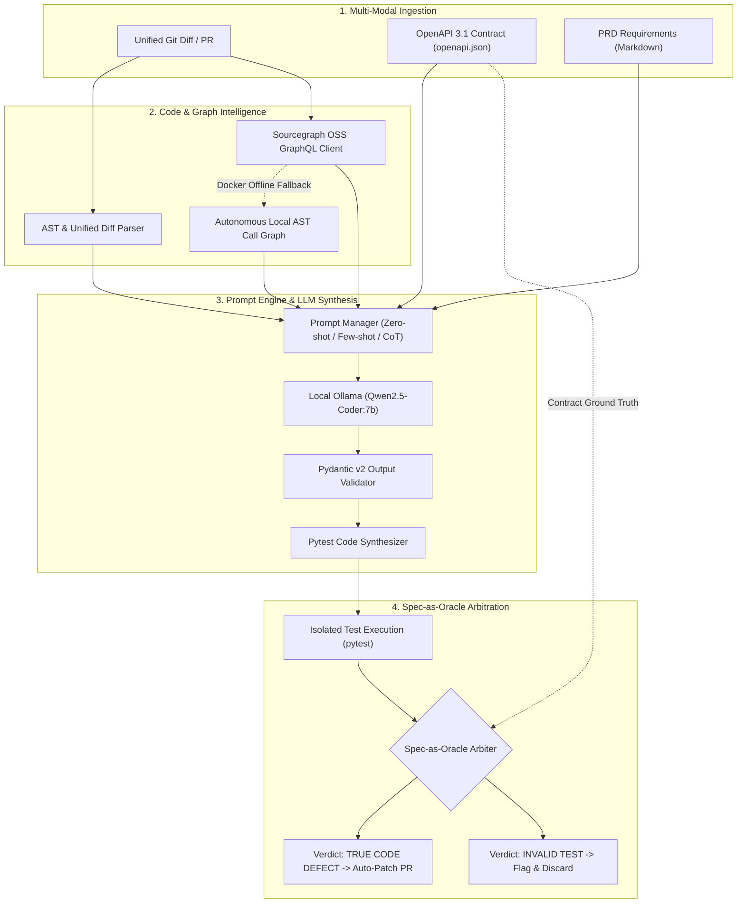

# TestPilot AI: Autonomous Spec-as-Oracle Testing and Regression Remediation Agent

[](https://python.org)
[](https://fastapi.tiangolo.com)
[](https://docs.pydantic.dev)
[](https://ollama.ai)
[](LICENSE)

> **Course**: CSE 4011 — Intelligent Developer Tools and AI DevOps Workflows  
> **Role**: Senior Staff Engineer (DevOps & ML Systems) + Capstone Review Panelist  
> **Phase 1 Evaluation (30% Weight)**: Week of September 21, 2026  

---

## 1. The Core Paradigm: Spec-as-Oracle

Modern automated testing and LLM test generation tools suffer from a fatal assumption: **they treat existing code as the ground truth oracle**. When code contains subtle edge-case defects, LLMs faithfully write test assertions that test *what the code currently does*, institutionalizing bugs as permanent specification debt.

**TestPilot AI** inverts this relationship with the **Spec-as-Oracle** architecture:
- **Specifications (OpenAPI 3.1 contracts, JSON Schemas, PRD constraints) are the infallible ground truth.**
- Code diffs are assumed to be fallible hypotheses.
- When an edge-case test fails in CI, TestPilot's Arbiter disambiguates between:
  1. **True Code Defect**: Code deviated from formal specification $\rightarrow$ Auto-generates remediation patch PR.
  2. **Invalid Test Assertion / Flaky Test**: Test asserted something contradictory to specification $\rightarrow$ Discarded.

```
                    ┌────────────────────────┐
                    │   OpenAPI 3.1 / PRD    │
                    │ (Ground Truth Oracle)  │
                    └───────────┬────────────┘
                                │
                 Is output compliant with spec?
                                │
                 ┌──────────────┴──────────────┐
                 ▼                             ▼
              [ YES ]                       [ NO ]
      ┌───────────────────────┐   ┌───────────────────────────┐
      │ INVALID TEST / DRIFT  │   │     TRUE CODE DEFECT      │
      │ Suppress & flag debt  │   │ Mark PR Red & Auto-Remedy │
      └───────────────────────┘   └───────────────────────────┘
```

---

## 2. Strategic Differentiation: TestForge vs. TestPilot AI

| Dimension | TestForge (Prior Project: CSE 3101) | TestPilot AI (Target Project: CSE 4011) |
| :--- | :--- | :--- |
| **Core Problem** | Eliminating hollow assertions in isolated unit tests | Specification drift and regression arbitration in CI/CD PRs |
| **Ground Truth / Oracle** | **Code is Oracle**: Mutates code to evaluate test kill rate | **Spec is Oracle**: Code is fallible; checked against OpenAPI/PRD |
| **Execution Domain** | Local interactive workstation (Streamlit UI) | **Production CI/CD Pipelines** (Headless CLI + GitHub Actions) |
| **Code Scope** | Single isolated Python file/module | **Full Multi-File Repo Intelligence** (Call graphs & blast radius) |
| **Core AI Engine** | Apple MLX GPU MLP Neural Classifier | **Prompt Harness (Zero/Few/CoT)** + Ollama `qwen2.5-coder:7b` |
| **Failure Resolution** | Retries test generation until mutants die | **Arbitrates Defect vs. Test Debt** and creates remediation PRs |

---

## 3. End-to-End System Architecture



---

## 4. Repository Layout

```
TestPilot/
├── docs/
│   ├── SYNOPSIS.md              # Phase 1 Capstone Charter & Academic Synopsis
│   ├── ARCHITECTURE.md          # Full Architectural Blueprint & Data Contracts
│   └── PHASE1_EVALUATION.md     # Step-by-Step Viva Demonstration Script
├── testbed/                     # Realistic Target Microservice
│   ├── openapi.json             # Exported OpenAPI 3.1 specification
│   └── app/
│       ├── models.py            # Pydantic v2 schemas (CartItem, Order, etc.)
│       ├── services/
│       │   └── order_service.py # Domain logic with 3 intentional boundary bugs
│       └── main.py              # FastAPI REST endpoints + CLI export flag
├── testpilot/                   # TestPilot AI Core Package
│   ├── core/
│   │   └── models.py            # AST, Prompt, and Verdict domain models
│   ├── ast_engine/
│   │   └── treesitter_parser.py # AST parser for unified git diffs & boundary values
│   ├── sourcegraph/
│   │   └── client.py            # GraphQL client with local AST fallback
│   ├── llm/
│   │   ├── client.py            # Ollama client with JSON schema enforcement
│   │   └── prompt_manager.py    # Zero-shot, Few-shot, CoT boundary templates
│   ├── generator/
│   │   └── synthesizer.py       # Syntax-validated Pytest test suite generator
│   └── cli.py                   # Rich terminal CLI
├── docker/
│   └── docker-compose.sourcegraph.yml # Sourcegraph OSS container configuration
├── tests/                       # Test suite
│   ├── test_ast_parser.py       # AST parser and diff chunk tests
│   ├── test_sourcegraph_client.py # GraphQL & local call graph fallback tests
│   ├── test_prompts.py          # Prompt engineering & JSON parsing tests
│   └── test_synthesizer.py      # Pytest synthesis and syntax validation tests
├── pyproject.toml               # Project metadata and CLI script bindings
└── ruff.toml                    # Code style and linting rules
```

---

## 5. Quickstart & Installation

### Prerequisites
- Python 3.10+ (macOS / Linux)
- [Ollama](https://ollama.ai) installed with `qwen2.5-coder:7b`:
  ```bash
  ollama pull qwen2.5-coder:7b
  ```

### Setup Environment
```bash
git clone https://github.com/sourabhJain121/TestPilot.git
cd TestPilot

# Create and activate virtual environment
python3 -m venv .venv
source .venv/bin/activate

# Install dependencies and CLI in editable mode
pip install -e .
```

---

## 6. CLI Commands & Evaluation Walkthrough

### 1. System Health Check
Verify Python runtime, local Ollama connectivity, model readiness, and code graph resolution:
```bash
testpilot status
```

### 2. AST Parsing & Boundary Discovery
Inspect decision branch nodes and automatically discovered boundary candidates:
```bash
testpilot parse-diff --file testbed/app/services/order_service.py
```

### 3. Sourcegraph Symbol Navigation & Blast Radius
Query downstream callers using Sourcegraph GraphQL or local AST fallback:
```bash
testpilot check-sourcegraph calculate_order_totals
```

### 4. Synthesize Boundary Tests with Chain-of-Thought
Generate executable `pytest` tests using local `qwen2.5-coder:7b`:
```bash
testpilot generate-tests --file testbed/app/services/order_service.py --technique cot --output tests/generated/test_order_service.py
```

### 5. Execute Spec-as-Oracle Arbitration
Run the generated tests against the testbed microservice and arbitrate the 3 seeded boundary bugs:
```bash
testpilot verify
```

---

## 7. Phase 1 Evaluation Day-by-Day Checklist

- [x] **Day 1**: Monorepo scaffolding with `ruff`, `mypy`, and pytest. Submit the **One-Page Project Charter** (`docs/SYNOPSIS.md`).
- [x] **Day 2**: Deploy modular FastAPI microservice (`testbed/`) with 3 interdependent routes and intentional boundary bugs. Export its `openapi.json`.
- [x] **Day 3**: Launch Sourcegraph via Docker (`sourcegraph/server:5.3.0`). Build the Python client (`sourcegraph/client.py`) to query caller references via GraphQL.
- [x] **Day 4**: Implement resilient fallback: `treesitter_parser.py` extracting AST definitions directly from unified git diffs without external dependencies.
- [x] **Day 5**: Build the Prompt Engine (`prompt_manager.py`) using local Ollama (`qwen2.5-coder:7b`). Implement zero-shot vs. chain-of-thought prompt templates for boundary value discovery.
- [x] **Day 6**: Wire AST diff context into the prompt engine. Validate generated `pytest` code using Pydantic schema constraints.
- [x] **Day 7**: Phase 1 dry run: Demonstrate live Sourcegraph symbol cross-referencing and prompt-driven test generation from the terminal.

---

## 8. Academic Deliverables & Documentation

- [Project Charter & Synopsis](file:///Users/sourabh/TestPilot/docs/SYNOPSIS.md)
- [Architecture Specification](file:///Users/sourabh/TestPilot/docs/ARCHITECTURE.md)
- [Phase 1 Viva & Demo Script](file:///Users/sourabh/TestPilot/docs/PHASE1_EVALUATION.md)
